### Informe de Práctica: Despliegue de una Máquina Virtual en Azure y Configuración de un Servidor Simple 🚀

#### 1. Objetivo

El objetivo de esta práctica es desplegar una máquina virtual en Azure y configurar un servidor simple que sirva un mensaje de "Hello, World!" en el puerto 8080. A continuación, se describe el procedimiento paso a paso para alcanzar este objetivo.

#### 2. Creación de la Máquina Virtual 🖥️

1. **Acceso al Dashboard de Azure**
   - Primero, accede al dashboard de Azure desde el portal principal.
   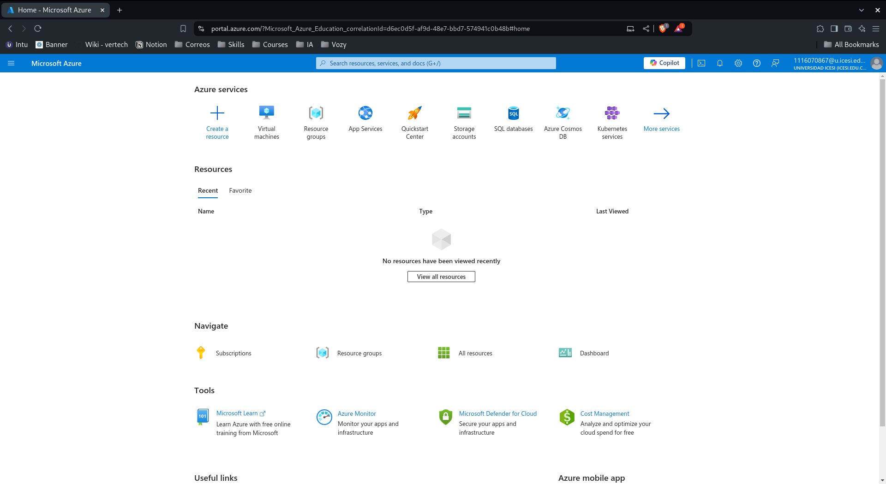

2. **Selección de la Máquina Virtual**
   - En la barra de búsqueda, escribe "Virtual machine" o selecciona la opción desde el acceso rápido.
   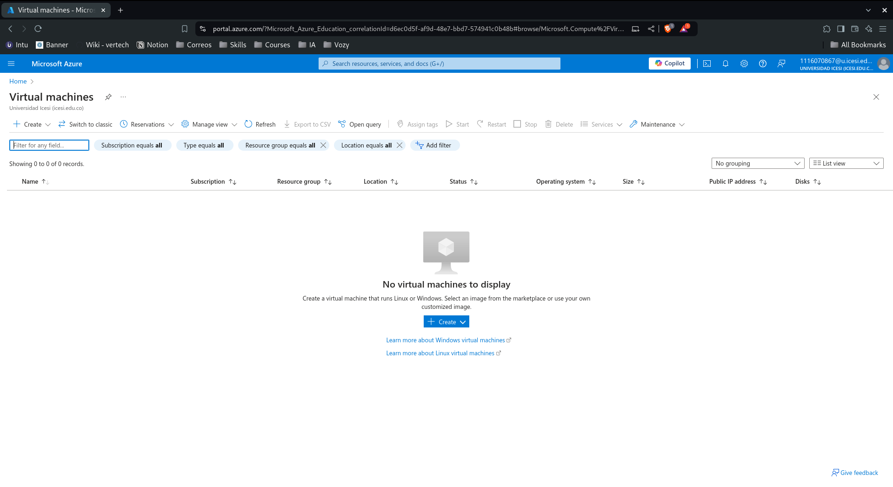
   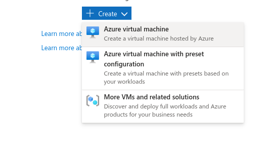

3. **Creación de la Máquina Virtual**
   - En el dashboard, selecciona la opción para crear una nueva máquina virtual. Como era la primera vez que se creaba una máquina virtual en este entorno, no había ninguna existente en el dashboard.
   - **Información de la Máquina Virtual:**
     - **Nombre:** juan-machine
     - **Suscripción:** Azure for Students
     - **Ubicación:** East US
     - **Tamaño de la VM:** Standard B2pts - Free Layer
     - **resources/imagen del SO:** Ubuntu Server 24.0 ARM
     - **Arquitectura de la VM:** ARM64
     - **Tipo de Autenticación:** Usuario y Contraseña
     - **Tipo de Disco:** HDD Standard
   - Completa las configuraciones necesarias y crea la máquina virtual.
   
   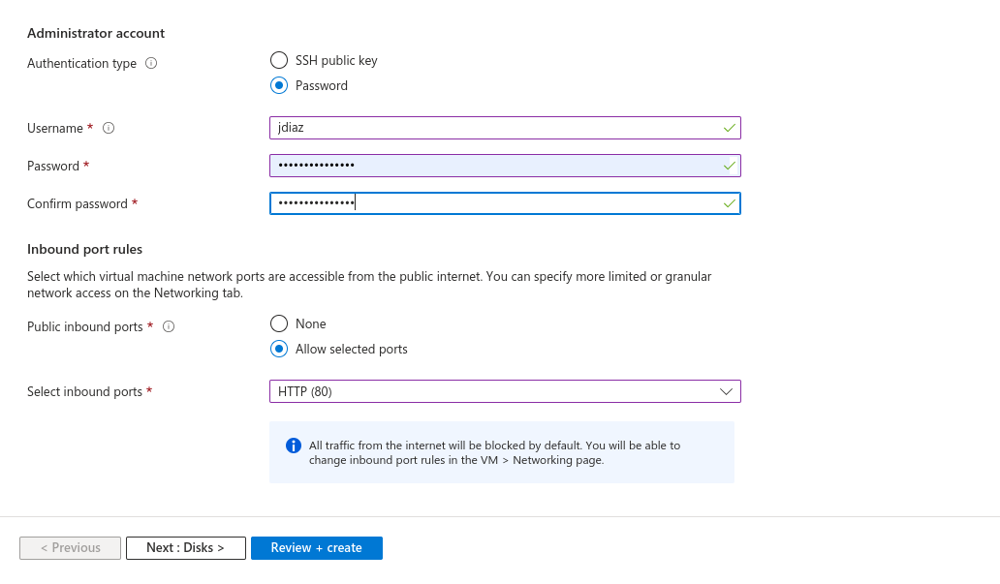
   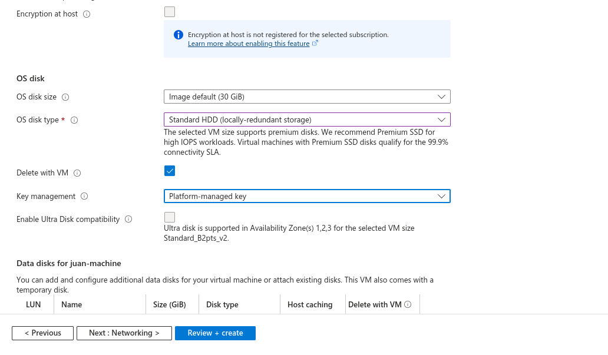
   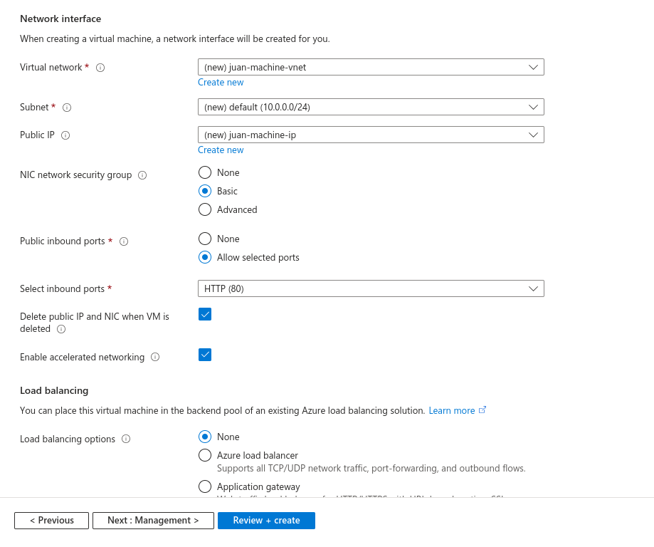

4. **Configuración de la Máquina Virtual**
   - Elige la suscripción y configura un grupo de recursos (puede ser uno existente o uno nuevo).
   - Completa el resto de las configuraciones necesarias para la máquina virtual.
   - La máquina virtual se crea exitosamente.
   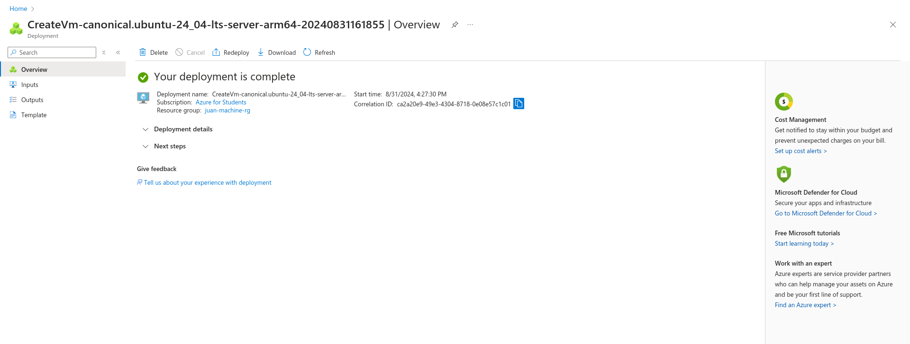

5. **Acceso al Dashboard de la Máquina Virtual**
   - Accede al dashboard de la máquina virtual recién creada.
   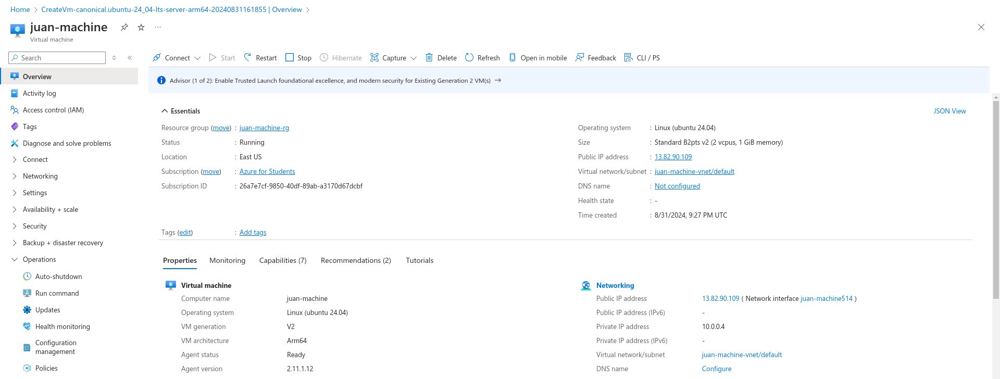
   - Utiliza la dirección IP pública para conectarte por SSH con el usuario y la contraseña asignados.
   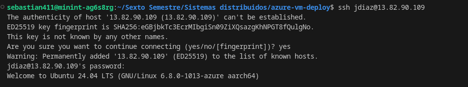
   - Verifica que el puerto 22 esté abierto para permitir la conexión SSH.
   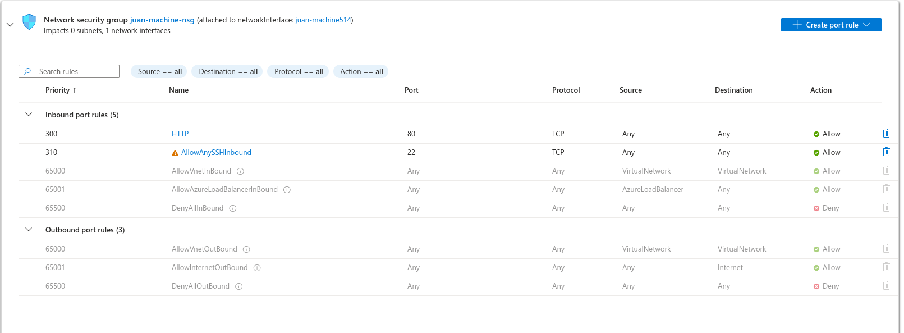

#### 3. Configuración del Servidor Simple 🌐

1. **Conexión por SSH**
   - Conéctate a la máquina virtual mediante SSH. Una vez conectado, abre el puerto 8080 en las reglas de entrada del grupo de seguridad de la máquina virtual.

2. **Creación del Script Hello World**
   - Crea un archivo llamado `hello_world.py` usando el editor de texto `nano` con el siguiente comando:
     ```bash
     nano hello_world.py
     ```
   - Escribe el siguiente código en el archivo:
     ```python
     from http.server import BaseHTTPRequestHandler, HTTPServer

     class HelloWorldHandler(BaseHTTPRequestHandler):
         def do_GET(self):
             self.send_response(200)
             self.send_header("Content-type", "text/plain")
             self.end_headers()
             self.wfile.write(b"Hello, World!")

     def run(server_class=HTTPServer, handler_class=HelloWorldHandler):
         server_address = ('', 8080)  # Escucha en todas las interfaces en el puerto 8080
         httpd = server_class(server_address, handler_class)
         print("Servidor corriendo en el puerto 8080...")
         httpd.serve_forever()

     if __name__ == "__main__":
         run()
     ```
   - Guarda el archivo y ejecútalo en segundo plano con el siguiente comando:
     ```bash
     python3 hello_world.py &
     ```

3. **Acceso al Servidor Web**
   - Desde un navegador web, accede al servidor utilizando la IP pública de la máquina virtual y el puerto 8080.
   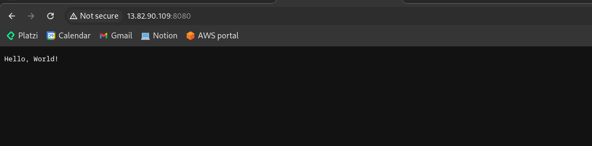

#### 4. Conclusiones 🎉

La práctica demostró con éxito la capacidad de desplegar y configurar una máquina virtual en Azure, así como la ejecución de un servidor web simple. Para evitar costos innecesarios, se recomienda apagar la máquina virtual cuando no esté en uso. Esta práctica proporciona una comprensión básica de cómo gestionar máquinas virtuales en Azure y realizar configuraciones básicas de red y servidor. ☁️